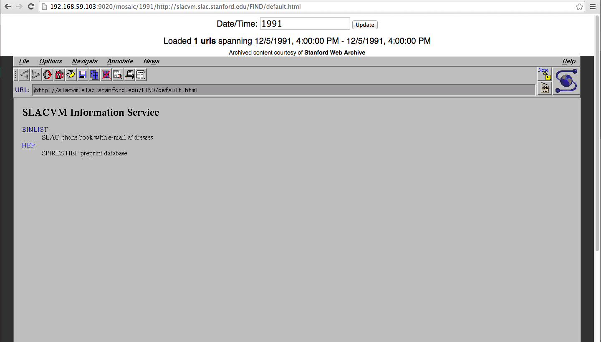
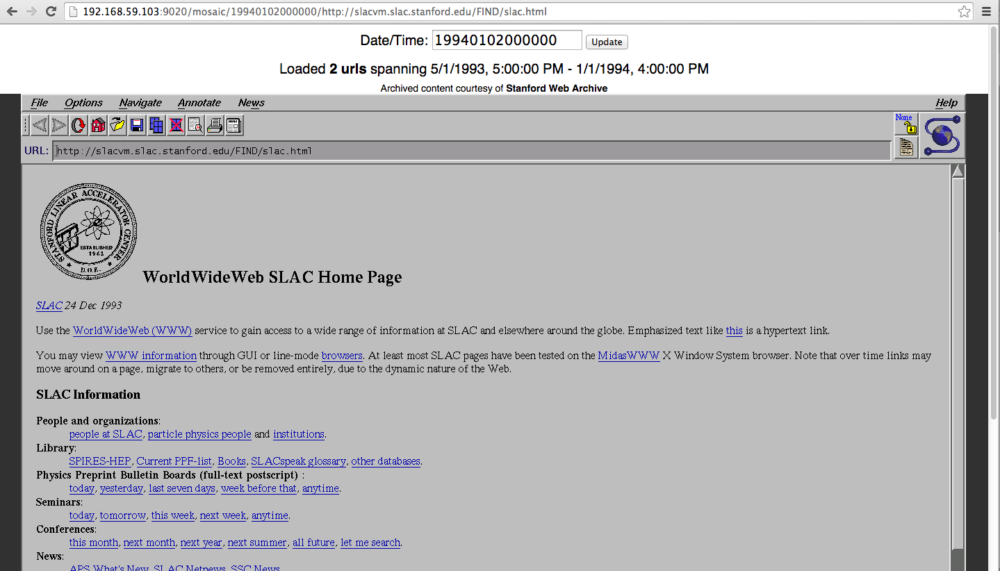
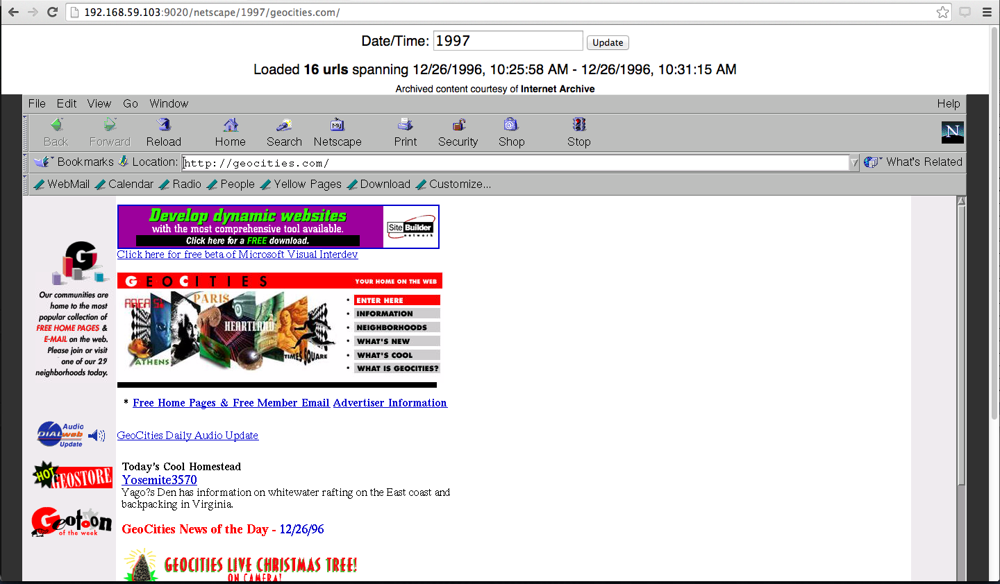
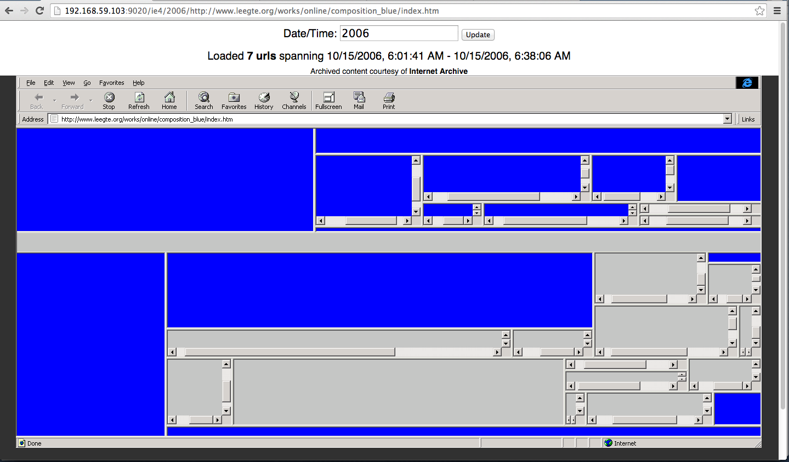
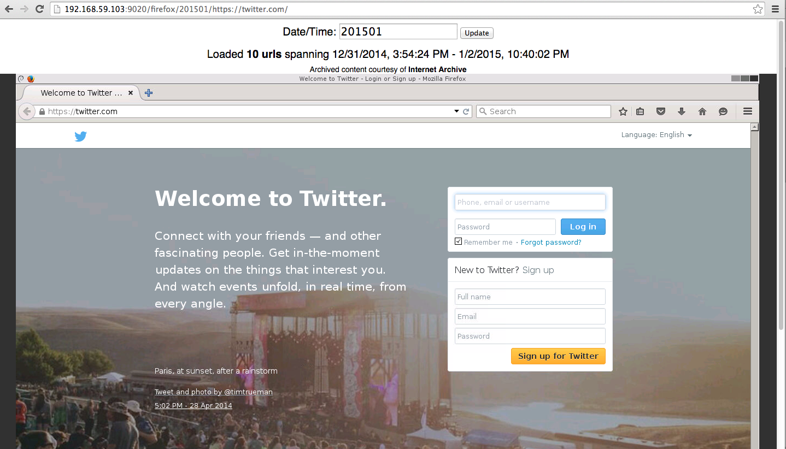

# OldWeb.today / Netcapsule #

## Browse old websites the old way ##

**This system is now deployed on http://oldweb.today/**

Netcapsule is a proof-of-concept system for browsing old web sites from existing web archives in old browsers, inside a modern browser.

When the Netcapsule web page is loaded, the old browser is loaded in an emulator-like setup (Docker container) connecting to an existing archiving service through an HTTP/S proxy (powered by [pywb] (https://github.com/ikreymer/pywb) software). The proxy configures the date/time
setting and proxies the content from the archive in its original form (whenever possible).

Any web archive (supporting CDX or Memento protocol interfaces) can be a source, and any browser running under Linux can be used.
Currently included browsers are:

 - **Mosaic**

   - *Mosaic 2.7 on Linux*

 - **Netscape**
   - *Netscape 3.04 on Mac*
   - *Netscape 4.08 on Mac*
   - *Netscape 4.79 on Linux*
   - *Netscape 4.8 on Windows*
   - *Netscape 4.8 on Mac*

 - **Internet Explorer**
   - *IE 4.0 on Windows*
   - *IE 4.01 on Mac*
   - *IE 5.1.7 on Mac*
   - *IE 5.5 on Windows*

 - **Safari**
   - *Safari 3 on Windows*
 
 - **Firefox**
   - *Firefox 40 on Linux*

 - **Chrome**
   - *Chrome 46 on Linux*

The system allows user to navigate by both url and by time.

The date can be changed dynamically by entering a new date/time (in 14-digit format currently) and hitting *Update*.
The virtual browser must then be reloaded to reflect the new date/time settings.

Note: Netcapsule now requires latest Docker Engine 1.9 and Docker Compose 1.5


### Sample screenshots

*TODO: Update screenshots to new UI that is now on http://oldweb.today These screenshots reflect old prototype UI*

First US web site, from 1991, in NCSA Mosaic (archive courtesy of Stanford web archives), see http://www.slac.stanford.edu/history/earlyweb/firstpages.shtml)

(URL: `<HOST>/mosaic/1991/http://slacvm.slac.stanford.edu/FIND/default.html`)



Another early SLAC site, from 1994, in NCSA Mosaic (archive courtesy of Stanford web archives):

(URL: `<HOST>/mosaic/19940102000000/http://slacvm.slac.stanford.edu/FIND/slac.html`)



`http://geocities.com` from end of 1996, in Netscape Navigator 4 (archive courtesy of Internet Archive):

(URL: `<HOST>/netscape/1997/http://geocities.com/`)



Scrollbar - Composition Blue archive from 2006, in Internet Explorer 4 (archive courtesy of Internet Archive):

(URL: `<HOST>/ie4/2006/http://www.leegte.org/works/online/composition_blue/index.htm`)



`https://twitter.com/` from early 2015 in modern Firefox (archive courtesy of Internet Archive):

(URL: `<HOST>/firefox/201501/https://twitter.com/`)



### Running

To run locally, Docker and Docker Compose are required.

1. Clone this repo

2. Run `pull-containers.sh` to pull all existing containers from Docker Hub. Alternatively, you can run `browsers/build-containers.sh` to build them locally.

3. Run `run-local.sh`, which will invoke Docker Compose build and run steps. (Netcapsule uses the new Docker networking,
requiring Docker Engine 1.9 and Compose 1.5)

5. You can now access the different browsers under: 

   `http://<DOCKER_HOST>:9020/<BROWSER>/<TS>/<URL>` where `<BROWSER>` is one of `netscape`, `firefox`, `mosaic`, etc..
   
   Netcapsule main app runs on port `9020` and can be changed in `docker-compose.yml`.

### How It Works

### Supported Browsers

The `browsers` directory corresponds to each supported browser and a `base-browser` image which serves as the base.

Current Browsers include:
   * Moscaic (built from https://github.com/alandipert/ncsa-mosaic) `netcapsule/mosaic`
   * Netscape 4.79 (built based on [instructions from here](https://www.ailis.de/~k/archives/75-Netscape-Navigator-4-on-Ubuntu-Linux-12.10.html) `netcapsule/netscape`
   * Firefox 40 `netcapsule/firefox`
   * Internet Explorer 4.02 `netcapsule/ie4` (using WINE, built with [steps from here](https://appdb.winehq.org/objectManager.php?sClass=version&iId=2743)
   * Internet Explorer 5.5 `netcapsule/ie5.5` (using WINE, built with [steps from here](https://appdb.winehq.org/objectManager.php?sClass=version&iId=240)
   * Safari 5 `netcapsule/safari5` (using WINE, built with `winetricks`)
   * Netscape 4.08 `netcapsule/netscape-mac-4.08` on 68K MacOS Using [Basilik2](http://basilisk.cebix.net/)
   * See [Browsers](browsers) for all currently available browsers.


#### Adding new browsers

To add a new browser, a new image should be created to extend `netcapsule/base-browser`.
This base images sets up a number of settings, such as Xvfb, VNC server, [noVNC](https://github.com/kanaka/noVNC), [Fluxbox](http://fluxbox.org)

For adding [WINE](https://www.winehq.org/) (Windows-based browsers), extend the `netcapsule/base-wine-browser` image which
provides a latest stable build of WINE.

For adding [Basilik2](http://basilisk.cebix.net/) (Mac-based browsers), extend the `netcapsule/base-basilisk2-browser` image
which includes an installation of BasiliskII.

* A `run.sh` file is usually used to start the browser.
* The `$URL` environment variable can be used to start browser at requested url.
* To read data from the archives, The HTTP (and optionally HTTPS) proxy servers should be set to
  `netcapsule_pywb_1:8080`. These setting are browser dependent.
* A [fluxbox-apps](http://fluxbox.org/help/man-fluxbox-apps.php) config is usually provided to have Fluxbox start the browser in either a fullscreen or maximized state.
* Finally, add the browser to the `app/config.yaml` browser configuration and rebuild with `docker-compose build`

For convenience, the new browser Docker image build can be added to `browsers/build-browsers.sh` script.
Consult the existing browser setups for examples on how to add browsers.


### General Workflow

The system operates by running a simple web app as the entry point. When a request is received, an appropriate Docker container is created
for that user session. The session establishes a VNC connection (using noVNC) over a websocket (using websockify), which streams X session
running in the Docker container.

A small python app is also running on the container and is pinged periodically to indicate the session is still active, and to receive
information about the current web content viewed.

The HTTP/S proxy is a version of [pywb](https://github.com/ikreymer/pywb) which also stores additional state info in Redis, per Docker container. This allows the proxy to track which urls are loaded per session, which hosts are used, etc..

This idea is extended from the [Memento Reconstruct](https://github.com/ikreymer/memento-reconstruct)


### Configuration

The system can be configured to read from two different types of web archive sources, a Memento aggregator or a CDX server.

These sources are specified as two collections, `memento_reconstruct` and `single_archive` in the pywb `config.yaml` file,
in the pywb directory.


#### Memento API Source

This is the default configuration and uses the Memento JSON API (see: http://timetravel.mementoweb.org/guide/api/#memento-json) to read across multiple web archives which support the Memento protocol.

This setting uses the Memento aggregator hosted by Los Alamos National Laboratory (LANL). It uses as a spec the following list of archives: http://labs.mementoweb.org/aggregator_config/archivelist.xml

This can be changed by specifying a different file in the `pywb/config.yaml`

```
# Specify memento archivelist XML
memento_archive_xml: 'http://labs.mementoweb.org/aggregator_config/archivelist.xml'
```

The relevant Memento timegate and timemap settings are also set as:
```
    memento_reconstruct:
        index_paths:
            - http://timetravel.mementoweb.org/api/json/
            - http://labs.mementoweb.org/timemap/json/
```

This setting may point to a local version of the `archivelist.xml` which can be modified as needed.

The source is configured via the default collection in `config.yaml`

```
    use_default_coll: 'memento_reconstruct'
```

Note: This system is partially adapted from the [Memento Reconstruct project](https://github.com/ikreymer/memento-reconstruct) deployed at
http://timetravel.mementoweb.org/ when clicking the *Reconstruct* option.

#### CDX API Source

Alternatively, any CDX server source can be used, including any deployment of pywb or OpenWayback which supports the [pywb CDX Server API](https://github.com/ikreymer/pywb/wiki/CDX-Server-API) or [OpenWayback CDX Server API](https://github.com/iipc/openwayback/blob/master/wayback-cdx-server-webapp/README.md)


For example, the default settings are configured to use the Internet Archive Wayback CDX Server as follows:

```
    single_archive:
        index_paths: 'http://web.archive.org/cdx/search/cdx'
        archive_template: 'http://web.archive.org/web/{timestamp}id_/{url}'
        archive_name: 'Internet Archive'
```

This can be altered to point to any other CDX server.

To enable this source, ensure that it is set as the default collection:

```
    use_default_coll: 'single_archive'
```


### TODO List

This system is still an early proof-of-concept and there is much room for improvement. I would encourage and welcome contributions to this project any one interested. Here are some things that could be improved:

* UI improvements: Add a timeline of archived captures/mementos, indicating a timeline of archive copies, better data about source archives, etc...

* Actual emulator support: Run actual emulators in Docker to support browsers from different OSes and browsers that do not run on Linux

* Add support for Memento Link format API, to support archives that use this format (and do not support CDX).

* Input validation, eg. for Date/Time, URL, etc...

* Improved documentation.

* Better abstraction for Docker customization.

* Additional browsers, list supported browsers, etc...

* Any VNC configuration optimizations.


### LICENSE

This software is released under the [MPL 2.0](http://www.mozilla.org/MPL/2.0/). Created by Ilya Kreymer, September, 2015.

Portions under the `./app/static/include/*.js` which are part of the [noVNC](https://github.com/kanaka/noVNC) project, also licensed under [MPL 2.0](http://www.mozilla.org/MPL/2.0/).

See LICENSE.txt for details.

Honored to have received support for this project from:


and

