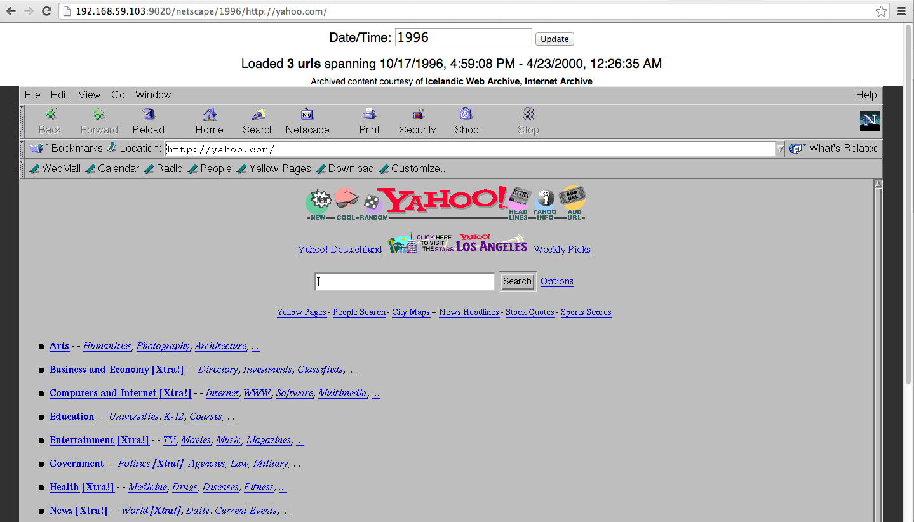

# NetCapsule #

## Browse old websites the old way ##

NetCapsule is a proof-of-concept system for browsing old web sites from existing web archives in old browsers, inside a modern browser.

When the NetCapsule web page is loaded, the old browser is loaded in an emulator-like setup (Docker container) connecting to an existing archiving service through an HTTP/S proxy (powered by [pywb] (https://github.com/ikreymer/pywb) software). The proxy configures the datetime
setting and proxies the content from the archive in its original form (whenever possible).

Any web archive (supporting CDX or Memento protocol interfaces) can be a source, and any browser running under Linux can be used.
Currently included browsers are *Mosaic 2.7*, *Netscape 4* and a modern *Firefox 40*.

### Examples screenshots

First US web site, from 1991, in NCSA Mosaic (courtesy of Stanford web archives), see http://www.slac.stanford.edu/history/earlyweb/firstpages.shtml)

Another early SLAC site, from 1994, under NCSA Mosaic (courtesy of Stanford web archives):

http://yahoo.com from 1996, (courtesy of Internet Archive Wayback Machine, and Icelandic Web Archive):

https://twitter.com/ from early 2015, (courtesy of Internet Archive Wayback Machine):

### Running

To run locally, Docker and Docker Compose are required.

1. Clone this repo

2. Run `pull-containers.sh` to pull all existing containers from Docker Hub. Alternatively, you can run `browsers/build-containers.sh` to build them locally.

3. Run `docker-compose up -d`

4. You can now access the different browsers under: 

   `http://<DOCKER HOST>/<BROWSER>/<TS>/<URL>`
   
    where `<BROWSER>` is one of `netscape`, `firefox`, `mosaic`

### How It Works

### Supported Browsers

The `browsers` directory corresponds to each supported browser and a `base-browser` image which serves as the base.

Current Browsers are:
   * Moscaic (built from https://github.com/alandipert/ncsa-mosaic) `ikreymer/netcapsule-mosaic`
   * Netscape 4 (built based on instructions form https://www.ailis.de/~k/archives/75-Netscape-Navigator-4-on-Ubuntu-Linux-12.10.html) `ikreymer/netcapsule-netscape`
   * Firefox 40 `ikreymer/netcapsule-firefox`

Each browser corresponds to a Docker image which extends `ikreymer/netcapsule-base-browser`.

#### Adding new browsers

To add a new browser, a new image should be created to extend `ikreymer/netcapsule-base-browser`.
This base images sets up a number of settings, such as Xvfb, VNC server, [noVNC](https://github.com/kanaka/noVNC), [Fluxbox](http://fluxbox.org)

* A `run.sh` file is usually used to start the browser.
* The `$URL` environment variable can be used to start browser at requested url.
* To read data from the archives, The HTTP (and optionally HTTPS) proxy servers should be set to
  `netcapsule_pywb_1:8080`. These setting are browser dependent.

Consult the existing browser setups for examples on how to add browsers.

### General Workflow

The system operates by running a simple web app as the entry point. When a request is received, an appropriate Docker container is created
for that user session. The session establishes a VNC connection (using noVNC) over a websocket (using websockify), which streams X session
running in the Docker container.

A small python app is also running on the container and is pinged periodically to indicate the session is still active, and to receive
information about the current web content viewed.

The HTTP/S proxy is a version of [pywb](https://github.com/ikreymer/pywb) which also stores additional state info in Redis, per Docker container. This allows the proxy to track which urls are loaded per session, which hosts are used, etc..

This idea is extended from the [Memento Reconstruct](https://github.com/ikreymer/memento-reconstruct)

